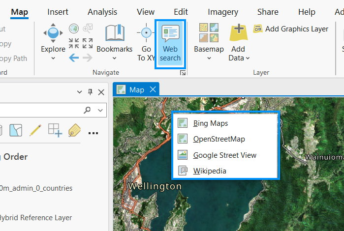

## Tool for coordinates searching on web mapping platform

<!-- TODO: Write a brief abstract explaining this sample -->
Left click on Map - opens Google Maps.<br />
Right click on Map - opens Bing Maps, OpenStreetMap, Google Street View, Wikipedia or custom (default - Baidu Maps).<br />
<br />
It saves a few clicks each time.<br />
<br />
   
<!-- TODO: Fill this section below with metadata about this sample-->
```
Language:              C#
Subject:               Map Exploration
Date:                  14/05/2023
ArcGIS Pro:            3.1
Visual Studio:         2022
.NET Target Framework: net6.0-windows
```

## How to install
<!-- TODO: Explain how this sample can be used. To use images in this section, create the image file in your sample project's screenshots folder. Use relative url to link to this image using this syntax:  -->
1. Download "AGP_CoordinateWST.esriAddinX". It can be found here: https://github.com/gisedulab/ArcGISPRO_Web_search_coordinate_tool/releases
2. Double click on file.
<!-- End -->
## How to change web mapping platform
<!-- TODO: Explain how this sample can be used. To use images in this section, create the image file in your sample project's screenshots folder. Use relative url to link to this image using this syntax:  -->
1. Open file AGP_CoordinateWST.txt<br />
It can be found here: User Folder\Documents\ArcGIS\AddIns\ArcGISPro<br />
The file will be created after first click on tool's button in ribbon.<br />
2. First line - web search string for Left click.
3. Second line - web search string for Custom button.
4. "LATITUDE" and "LONGITUDE" should be used to mark where coordinates must be in web search string.

## Web search string examples:
http://maps.google.com/maps?q=LATITUDE LONGITUDE<br />
https://www.bing.com/maps?q=LATITUDE LONGITUDE<br />
https://en.wikipedia.org/wiki/Special:Nearby#/coord/LATITUDE,LONGITUD<br />
https://www.openstreetmap.org/search?query=LATITUDE LONGITUDE<br />
http://map.baidu.com/?latlng=LATITUDE,LONGITUDE
<!-- End -->